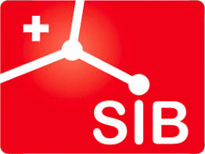
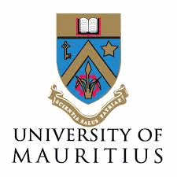

  
  
  
  
  

  

## Overview of the course material for the SIB "Introduction to Machine Learning" course

**When**: 22-23 July 2020, 09:00 - 16:30 CEST

**Where**: Online. Streamed from Greece and Mauritius. More information [here](https://www.sib.swiss/training/course/2020-07-machine-learning)

### Instructors and helpers

**Instructors**:

- [**Shakuntala Baichoo**](https://www.linkedin.com/in/shakuntala), [University of Mauritius](https://www.uom.ac.mu/), [H3ABioNet](https://www.h3abionet.org/)

- [**Fotis Psomopoulos**](https://fpsom.github.io/), [INAB-CERTH](http://inab.certh.gr), [ELIXIR-GR](https://www.elixir-greece.org/)

**Helpers**:

- **Wandrille Duchemin**, [sciCORE](https://scicore.unibas.ch/), [SIB](https://www.sib.swiss/)

- **Thuong Van Du Tran**, [Vital-IT](https://www.vital-it.ch/), [SIB](https://www.sib.swiss/)

### Overview
With the rise in high-throughput sequencing technologies, the volume of omics data has grown exponentially in recent times and a major issue is to mine useful knowledge from these data which are also heterogeneous in nature. Machine learning (ML) is a discipline in which computers perform automated learning without being programmed explicitly and assist humans to make sense of large and complex data sets. The analysis of complex high-volume data is not trivial and classical tools cannot be used to explore their full potential. Machine learning can thus be very useful in mining large omics datasets to uncover new insights that can advance the field of bioinformatics.

This 2-day course will introduce participants to the machine learning taxonomy and the applications of common machine learning algorithms to omics data. The course will cover the common methods being used to analyse different omics data sets by providing a practical context through the use of basic but widely used R libraries. The course will comprise a number of hands-on exercises and challenges where the participants will acquire a first understanding of the standard ML processes, as well as the practical skills in applying them on familiar problems and publicly available real-world data sets.

### Learning objectives

At the end of the course, the participants will be able to:
- Understand the ML taxonomy and the commonly used machine learning algorithms for analysing “omics” data
- Understand differences between ML algorithms categories and to which kind of problem they can be applied
- Understand different applications of ML in different -omics studies
- Use some basic, widely used R packages for ML
- Interpret and visualize the results obtained from ML analyses on omics datasets
- Apply the ML techniques to analyse their own datasets

### Audience and requirements

This course is intended for master and PhD students, post-docs and staff scientists familiar with different omics data technologies who are interested in applying machine learning to analyse these data. No prior knowledge of Machine Learning concepts and methods is expected nor required.

### Prerequisites

#### Knowledge / competencies

Familiarity with any programming language will be required (familiarity with R will be preferable).

#### Technical
This course will be streamed, you are thus required to have your own computer with an internet connection. In order to ensure clear communication between Instructors and participants, we will be using collaborative tools, such as [Google Drive](https://www.google.com/drive/) and/or Google Docs.

_Maximum participants_: 30

### Schedule

**Day 1**

| Time  |  Details |
|--------|----------|
| 09:00 - 09:30 | **Course Introduction**.     - Welcome.   - Introduction and CoC.   - Way to interact   - Practicalities (agenda, breaks, etc).  - Setup   [_Link to material_](episodes/setup.md) |
| 09:30 - 10:00 | **Introduction to Machine Learning** (_theory_) |
| 10:00 - 11:30 | **What is Exploratory Data Analysis (EDA) and why is it useful?** (_hands-on_)    - Loading omics data   - PCA  |
| 11:30 - 11:45 | _Coffee Break_ |
| 11:45 - 12:15 | **Introduction to Unsupervised Learning** (_theory_) |
| 12:15 - 13:00 | **Agglomerative Clustering: k-means** (_practical_) |
| 13:00 - 14:00 | _Lunch break_ |
| 14:00 - 14:45 | **Agglomerative Clustering: k-means** (_practical_) (cont'd) |
| 14:45 - 15:30 | **Divisive Clustering: hierarchical clustering** (_practical_) |
| 15:30 - 15:45 | _Coffee Break_ |
| 15:45 - 16:30 | **Divisive Clustering: hierarchical clustering** (_practical_) (cont'd) |
| 16:30         | _Closing of Day 1_ |

**Day 2**

| Time  |  Details |
|--------|----------|
| 09:00 - 09:30 | **Welcome Day 2**.     - Questions from Day 1   - Agenda   |
| 09:30 - 10:00 | **Introduction to Supervised Learning** (_theory_)     - Overview of multiple algorithms  
- Advantages and Disadvantages   |
| 10:00 - 10:30 | **Classification Metrics** (_theory_)     - F1 Score, Precision, Recall  
- Confusion Matrix, ROC-AUC   |
| 10:30 - 11:30 | **Classification** (_practical_)     - Decision trees  
- Random Forests   |
| 11:30 - 11:45 | _Coffee Break_ |
| 11:45 - 12:30 | **Classification** (_practical_) (cont'd)
| 12:30 - 13:30 | _Lunch break_ |
| 13:30 - 14:00 | **Regression** (_theory_) |
| 14:00 - 15:15 | **Regression** (_practical_)     - Linear regression   - Generalized Linear Model (GLM)  |
| 15:15 - 15:30 | _Coffee Break_ |
| 15:30 - 16:00 | **Regression** (_practical_) (cont'd) |
| 16:00 - 16:30 | _Closing questions, Discussion_ |

## Other examples

If you finish all the exercices and wish to practice on more examples, here are a couple of good examples to help you get more familiar with the different ML techniques and packages.
1. [RNASeq Analysis in R](https://combine-australia.github.io/RNAseq-R/06-rnaseq-day1.html)
2. [Use the Iris R built-in data set](https://github.com/fpsom/CODATA-RDA-Advanced-Bioinformatics-2019/blob/master/3.Day3.md)to run clustering and also some supervised classification and compare results obtained by different methods.

## Sources / References

The material in the workshop has been based on the following resources:

1. [ELIXIR CODATA Advanced Bioinformatics Workshop](https://codata-rda-advanced-bioinformatics-2019.readthedocs.io)
2. [Machine Learning in R](https://hugobowne.github.io/machine-learning-r/), by [Hugo Bowne-Anderson](https://twitter.com/hugobowne) and [Jorge Perez de Acha Chavez](https://twitter.com/jorge_pda)
3. [Practical Machine Learning in R](https://leanpub.com/practical-machine-learning-r), by [Kyriakos Chatzidimitriou](https://leanpub.com/u/kyrcha), [Themistoklis Diamantopoulos](https://leanpub.com/u/thdiaman), [Michail Papamichail](https://leanpub.com/u/mpapamic), and [Andreas Symeonidis](https://leanpub.com/u/symeonid).
4. [Linear models in R](https://monashbioinformaticsplatform.github.io/r-linear/topics/linear_models.html), by the [Monash Bioinformatics Platform](https://www.monash.edu/researchinfrastructure/bioinformatics)
5. Relevant blog posts from the [R-Bloggers](https://www.r-bloggers.com/) website.

Relevant literature includes:

1. [Pattern Recognition and Machine Learning](http://users.isr.ist.utl.pt/~wurmd/Livros/school/Bishop%20-%20Pattern%20Recognition%20And%20Machine%20Learning%20-%20Springer%20%202006.pdf) by Christopher M. Bishop.
2. [Machine learning in bioinformatics](https://academic.oup.com/bib/article/7/1/86/264025), by Pedro Larrañaga et al.
3. [Ten quick tips for machine learning in computational biology](https://biodatamining.biomedcentral.com/articles/10.1186/s13040-017-0155-3), by Davide Chicco
3. [Statistics versus machine learning](https://www.nature.com/articles/nmeth.4642)
4. [Machine learning and systems genomics approaches for multi-omics data](https://biomarkerres.biomedcentral.com/articles/10.1186/s40364-017-0082-y)
5. [A review on machine learning principles for multi-view biological data integration](https://academic.oup.com/bib/article/19/2/325/2664338)

## Additional information

**Coordination**: Monique Zahn

We will recommend 0.50 ECTS credits for this course (given a passed exam at the end of the course).

You are welcome to register to the SIB courses mailing list to be informed of all future courses and workshops, as well as all important deadlines using the form [here](https://lists.sib.swiss/mailman/listinfo/courses).

SIB abides by the [ELIXIR Code of Conduct](https://elixir-europe.org/events/code-of-conduct). Participants of SIB courses are also required to abide by the same code.

For more information, please contact [training@sib.swiss](mailto:training@sib.swiss).

## License

This material is made available under the [Creative Commons Attribution 4.0 International license](https://creativecommons.org/licenses/by/4.0). Please see [LICENSE](LICENSE.md) for more details.

## Citation

_tba_
